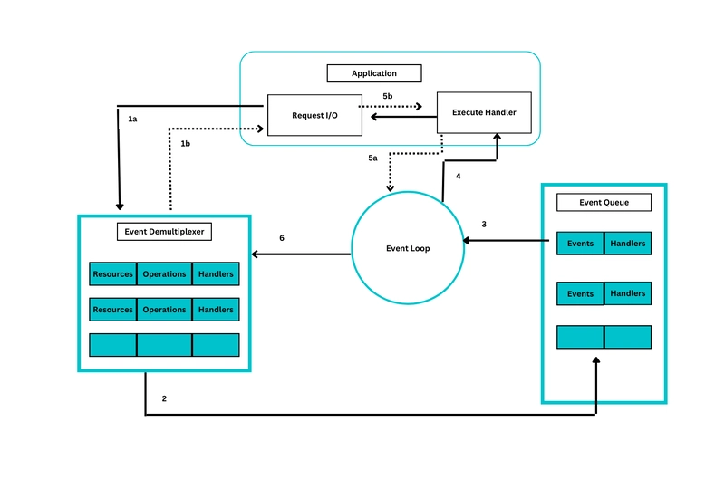

POC nodejs Reactor Pattern/Architecture

## What is Reactor Pattern?

The Reactor Pattern is an architectural pattern for building event-driven, non-blocking systems that must handle many concurrent I/O sources using very few threads.

It is based on three core components:

- Event demultiplexer (OS level)
- Event loop
- Event handlers (callbacks)

Node.js is a direct implementation of this pattern, using libuv as its reactor engine.

### NodeJS is single threaded?

JS is, but NodeJS uses libuv to delegate to other threads

### What is blocking/non blocking I/O?

- Blocking I/O: Application will make a function call and pause its execution at a point until the data is received. It is called as ‘Synchronous’.

- Non-Blocking I/O: Application will make a function call, and, without waiting for the results it continues its execution. It is called as ‘Asynchronous’.

### What is Event Demultiplexer?

It is provided by OS and pushes the new events into the Event Queue when a set of I/O operations is finished.

- Linux: epoll
- macOS: kqueue
- Windows: IOCP

### What is Event Loop?

An infinite loop that repeatedly performs these steps:

- Wait for events
- Move ready events to internal queues
- Execute the corresponding handlers

---

1 - The application initiates a new I/O operation by submitting a request to the Event Demultiplexer. The application also specifies a corresponding handler function, which will be executed when the operation is completed. It’s important to note that this request submission is a non-blocking call, meaning that the application continues its execution without waiting for the operation to finish.

2 - The Event Demultiplexer is responsible for monitoring and managing multiple I/O operations. When a set of I/O operations is completed, the Event Demultiplexer forwards the resulting events to the Event Queue.

3 - The Event Loop starts iterating over the items in the Event Queue.

4 - For each event in the Event Queue, the associated handler function is invoked. The handler function is a part of the application code and performs specific tasks related to the completed I/O operation. The execution of the handler function may involve additional asynchronous operations.

5 - During the execution of the handler function, it can delegate new asynchronous operations. In this case, the application submits new requests to the Event Demultiplexer before the control is returned to the Event Loop. This process continues recursively, enabling a smooth flow of asynchronous operations within the application.

6 - Once all items in the Event Queue are processed, the Event Loop returns to blocking mode, waiting for new events to arrive from the Event Demultiplexer.